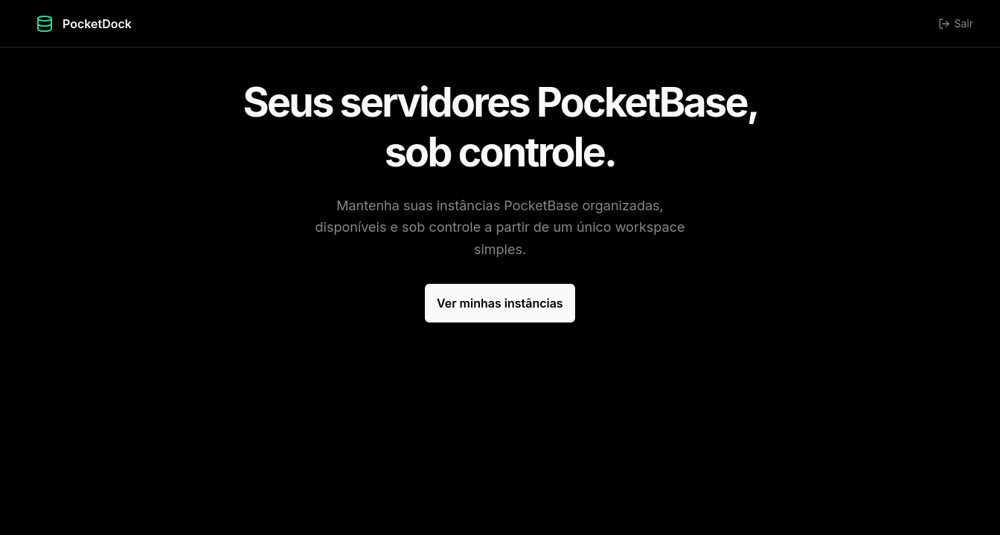
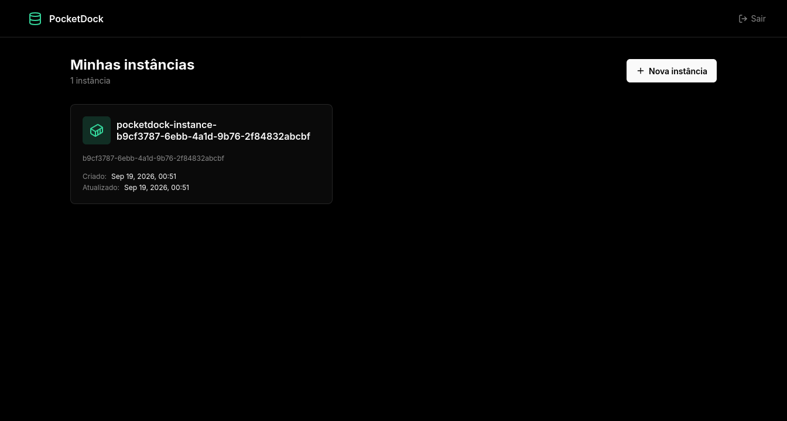
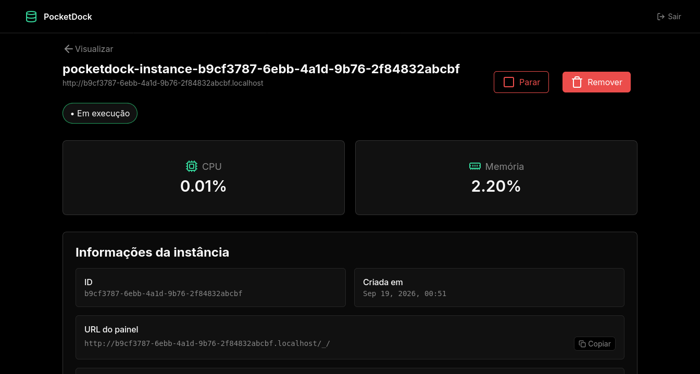
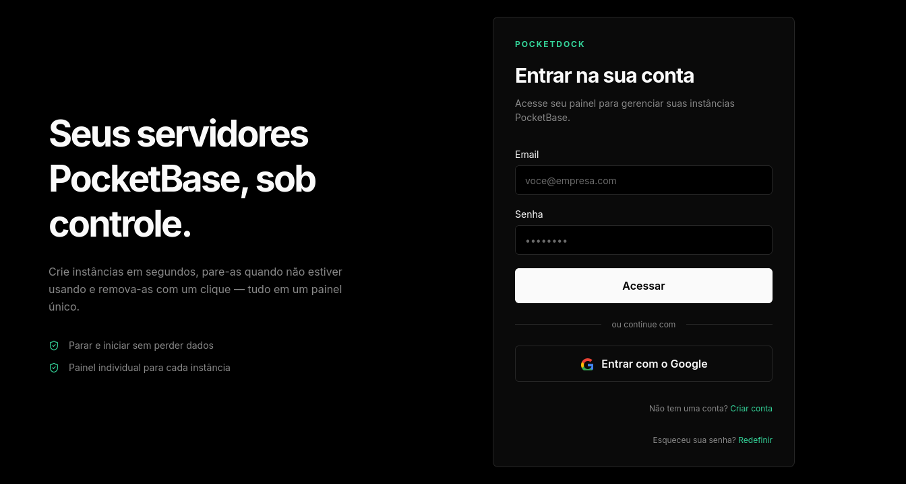

<div align="center">

  # PocketDock

 

  
  

  
  
  
  [](#)
  [](#)
  [](#)
  [](#)

</div>

<div align="center">

## 🖼️ Screenshots









</div>

## 📑 Sumário

- [Visão geral](#-visão-geral)
- [Tecnologias](#️-tecnologias)
- [Arquitetura](#️-arquitetura)
- [Pré-requisitos](#-pré-requisitos)
- [Instalando o PocketDock](#-instalando-o-pocketdock)
- [Variáveis de ambiente](#-variáveis-de-ambiente)
- [Avisos importantes](#-avisos-importantes)
- [Executando o PocketDock](#️-executando-o-pocketdock)
- [Recursos](#-recursos)
- [Licença](#-licença)

## 📚 Visão geral

PocketDock é uma plataforma web que permite criar e gerenciar, em poucos segundos, instâncias [PocketBase](https://github.com/pocketbase/pocketbase) isoladas e sob demanda. Após se cadastrar, cada usuário pode provisionar seus próprios ambientes PocketBase rodando em containers Docker, sem precisar se preocupar com infraestrutura ou configuração manual.

Cada instância é provisionada com superuser criado automaticamente, um subdomínio exclusivo e limites de CPU e memória, além de permitir acompanhar o consumo de recursos em tempo real.

## 🖥️ Tecnologias

| Tecnologia | Função |
| --- | --- |
| 🌐 **NestJS** | Framework utilizado para criar o backend da aplicação. |
| ⚛️ **React** | Biblioteca utilizada para criar o frontend da aplicação. |
| ⚡ **Vite** | Build tool utilizada para compilar e servir o frontend. |
| 🐘 **PostgreSQL** | Banco de dados relacional utilizado para persistir usuários, sessões e instâncias. |
| 🐳 **Docker** | Utilizado para provisionar e isolar os containers das instâncias PocketBase. |
| 🔀 **Traefik** | Reverse proxy que roteia cada instância para o seu subdomínio. O servidor não controla nem resolve os domínios: ele apenas adiciona os *labels* de roteamento aos containers e o Traefik descobre e roteia automaticamente por conta própria. |
| 🟦 **TypeScript** | Linguagem utilizada em toda a aplicação, adicionando tipagem estática e facilitando a manutenção. |

## 🏗️ Arquitetura

O projeto é dividido em duas aplicações principais e uma série de serviços provisionados pelo Docker Compose:

| Serviço | Descrição |
| --- | --- |
| 🌐 **client** | Frontend em React + Vite, responsável pela interface do usuário. |
| 🌐 **server** | Backend em NestJS, responsável pela API e pelo gerenciamento dos containers. |
| 🐘 **database** | PostgreSQL, utilizado como banco de dados da aplicação. |
| 🔀 **traefik** | Reverse proxy que roteia as requisições para cada instância PocketBase. Ele descobre os containers pelos *labels* e resolve os subdomínios automaticamente, sem nenhuma intervenção do servidor. |

## ✅ Pré-requisitos

Você pode executar o PocketDock de duas formas:

- **🐳 Docker (recomendado)** — apenas Docker e Docker Compose instalados.
- **💻 Localmente** — Node.js, PostgreSQL, Docker e Git instalados.

### Docker (recomendado)

- Docker
- Docker Compose

> O PocketDock gerencia containers Docker, portanto o daemon do Docker precisa estar acessível pelo host (socket em `/var/run/docker.sock`).

### Execução local

- Node.js **v22** ou superior
- PostgreSQL (local ou hospedado)
- Docker (para provisionar as instâncias)
- Git

## 🚀 Instalando o PocketDock

```bash
# Clone o repositório
git clone https://github.com/diegoarauj0/pocketdock-web.git
cd pocketdock-web

# Configure o arquivo de ambiente
cp .env.example .env

# Instale o servidor
cd ./server
npm install

# Instale o cliente
cd ../client
npm install

cd ../
```

> 💡 Depois de instalar, configure as [variáveis de ambiente](#-variáveis-de-ambiente) antes de iniciar a aplicação.

## ✍️ Variáveis de ambiente

As variáveis de ambiente são definidas no arquivo `.env` na raiz do projeto. Ele é consumido tanto pelo Docker Compose quanto pelos builds do servidor e do cliente.

O arquivo `.env.example` contém valores de exemplo e alguns valores públicos que podem ser expostos sem problemas.

Algumas variáveis possuem **valores padrão**, enquanto outras são **obrigatórias** para que o servidor funcione corretamente.

### Server

| Variável | Obrigatória | Descrição | Exemplo |
| --- | --- | --- | --- |
| `PORT` | Não | Porta em que a aplicação será iniciada. | `3000` |
| `NODE_ENV` | Não | Ambiente de execução da aplicação. | `development` |
| `SECRET` | Sim | Segredo utilizado para assinar os tokens JWT. | `your-secret-key` |
| `CORS_ORIGIN` | Sim | Origem permitida para as requisições CORS. | `http://localhost:5173` |
| `MAIL_STRATEGY_ID` | Sim | Estratégia de envio de e-mail: `LOCAL` (logs) ou `RESEND` (API). | `LOCAL` |
| `RESEND_FROM` | Não | Remetente dos e-mails enviados via Resend. | `onboarding@resend.dev` |
| `RESEND_API_KEY` | Não | Chave da API do Resend. Obrigatória se `MAIL_STRATEGY_ID` for `RESEND`. | `re_xxxxx` |
| `POSTGRES_HOST` | Sim | Host do servidor PostgreSQL. | `localhost` |
| `POSTGRES_PORT` | Sim | Porta do servidor PostgreSQL. | `5432` |
| `POSTGRES_USER` | Sim | Usuário do PostgreSQL. | `admin` |
| `POSTGRES_PASSWORD` | Sim | Senha do usuário do PostgreSQL. | `admin` |
| `POSTGRES_DB` | Sim | Nome do banco de dados. | `pocketdock` |
| `OAUTH_SUCCESS_REDIRECT_URL` | Sim | URL de redirecionamento após o login via OAuth. | `http://localhost:5173/auth/oauthCallback` |
| `GOOGLE_OAUTH_CLIENT_ID` | Não | Client ID da API do Google OAuth. | `xxxxx` |
| `GOOGLE_OAUTH_CLIENT_SECRET` | Não | Client Secret da API do Google OAuth. | `xxxxx` |
| `GOOGLE_OAUTH_REDIRECT_URI` | Não | URI de redirecionamento do Google OAuth. | `http://localhost:3000/api/oauth/google/callback` |
| `LOG_CONTEXTS` | Não | Contextos de log habilitados. | `log,error` |
| `DOCKER_HOST` | Sim | Endereço do daemon do Docker utilizado para gerenciar os containers. | `unix:///var/run/docker.sock` |
| `MAX_MEMORY_IN_MB` | Não | Limite de memória de cada instância, em MB. | `512` |
| `MAX_NANO_CPUS` | Não | Limite de CPU de cada instância, em nano CPUs. | `1000000000` |
| `INSTANCE_DOMAIN` | Sim | Domínio base utilizado para os subdomínios das instâncias, Ex.: `<id>.localhost`. | `localhost` |
| `INSTANCE_PROTOCOL` | Sim | Protocolo utilizado na URL pública das instâncias. | `http` |

### Client

O cliente utiliza a variável `VITE_API_URL`, definida no arquivo `.env` da raiz do projeto, para saber qual é a URL da API em tempo de build.

| Variável | Obrigatória | Descrição | Exemplo |
| --- | --- | --- | --- |
| `VITE_API_URL` | Sim | URL base da API do servidor. | `http://localhost:3000` |

## ⚠️ Avisos importantes

Antes de iniciar o servidor, tenha em mente os seguintes comportamentos:

- **🖼️ Imagem do PocketBase:** Ao inicializar, o backend verifica se a imagem `pocketdock/pocketbase` existe localmente. Caso ela não exista, o servidor faz o **build da imagem automaticamente**, o que pode levar alguns minutos na primeira execução. Esse build é feito apenas uma vez — nas inicializações seguintes, a imagem já existente é reaproveitada.

- **🌐 Rede dos containers:** Ao inicializar, o backend também verifica se a rede Docker `pocketdock-instances` existe. Caso não exista, ela é **criada automaticamente**. A rede é compartilhada entre todas as instâncias PocketBase e com o Traefik, permitindo o roteamento dos subdomínios.

- **🔀 Domínios e Traefik:** O servidor **não controla nem mexe nos domínios**. Ao criar uma instância, ele apenas adiciona os *labels* do Traefik no container (host do subdomínio, porta interna etc.). Quem resolve o roteamento é o próprio Traefik, que descobre os containers via Docker e encaminha as requisições de cada subdomínio para a instância correta — de forma 100% autônoma.

> ⚠️ Garanta que o daemon do Docker esteja acessível antes de iniciar o servidor. Sem acesso ao socket de `/var/run/docker.sock`, o backend não consegue provisionar a imagem e a rede, e a inicialização falha.

### 🔀 Sem o Docker Compose

Os arquivos `docker-compose.dev.yml` e `docker-compose.prod.yml` já vêm com o Traefik **pré-configurado** (provedor Docker habilitado, lendo os *labels* dos containers na rede `pocketdock-instances`). Se você **não** iniciar o projeto pelos arquivos do Docker Compose, será necessário configurar um Traefik por conta própria para que o roteamento funcione:

- **Descobrir os *labels*:** configure o provedor Docker do Traefik com `--providers.docker=true` e `--providers.docker.exposedbydefault=false`, e informe a rede padrão onde ele deve procurar os containers:
  ```bash
  traefik --providers.docker=true \
    --providers.docker.exposedbydefault=false \
    --providers.docker.network=pocketdock-instances
  ```
- **Conectar à rede:** os containers das instâncias são criados na rede `pocketdock-instances`. O container do Traefik precisa estar conectado a essa mesma rede para alcançar as instâncias (configure também o `INSTANCE_DOMAIN` e o `INSTANCE_PROTOCOL` no `.env` de acordo com o domínio real utilizado).

## ▶️ Executando o PocketDock

Após instalar as dependências e configurar as variáveis de ambiente, você pode executar o PocketDock utilizando Docker ou rodando os serviços localmente.

### 🐳 Docker (recomendado)

O Docker é a forma recomendada de executar a aplicação, pois provisiona e configura automaticamente todos os serviços necessários de maneira isolada, incluindo o banco de dados e o Traefik.

#### Desenvolvimento

```bash
docker compose -f docker-compose.dev.yml up --build

```

#### Produção

```bash
docker compose -f docker-compose.prod.yml up --build

```

### 💻 Execução local

Para executar sem o auxílio do Docker, é necessário possuir uma instância ativa do PostgreSQL e um daemon do Docker acessível em sua máquina.

#### Backend

```bash
cd server
npm run start:dev

```

#### Frontend

```bash
cd client
npm run dev

```

## 📜 Comandos úteis

| Comando | Descrição |
| --- | --- |
| `docker compose -f docker-compose.dev.yml up --build` | Inicia o ambiente de desenvolvimento. |
| `docker compose -f docker-compose.dev.yml down` | Encerra o ambiente de desenvolvimento. |
| `docker compose -f docker-compose.dev.yml restart` | Reinicia os serviços do ambiente de desenvolvimento. |
| `docker compose -f docker-compose.dev.yml logs -f` | Exibe os logs em tempo real do ambiente de desenvolvimento. |
| `docker compose -f docker-compose.prod.yml up --build` | Inicia o ambiente de produção. |
| `docker compose -f docker-compose.prod.yml down` | Encerra o ambiente de produção. |
| `docker compose -f docker-compose.prod.yml restart` | Reinicia os serviços do ambiente de produção. |
| `docker compose -f docker-compose.prod.yml logs -f` | Exibe os logs em tempo real do ambiente de produção. |

Por padrão, após a inicialização:

- O **cliente** ficará disponível em `http://localhost:5173`.
- A **API** ficará disponível em `http://localhost:3000`.
- O **PostgreSQL** ficará disponível na porta `5432`.
- O **Traefik** (dashboard) ficará disponível em `http://localhost:8080` (apenas no ambiente de desenvolvimento).

## 🔎 Recursos

| Recurso | Descrição |
| --- | --- |
| 🔐 **Autenticação** | Cadastro e login com e-mail e senha, verificação de e-mail, recuperação de senha e login via Google OAuth. |
| 📦 **Instâncias PocketBase** | Criação de instâncias isoladas sob demanda, com imagem própria (`pocketdock/pocketbase`). |
| 👤 **Superuser automático** | Superuser criado automaticamente em cada instância, usando o e-mail do usuário. |
| 🌐 **Subdomínios próprios** | Cada instância recebe um subdomínio exclusivo (`<id>.exemplo.com`), roteado pelo Traefik. |
| 🚦 **Limites de recursos** | Limite de CPU e memória aplicado em cada container. |
| 📊 **Monitoramento** | Acompanhamento do uso de CPU e memória de cada instância em tempo real. |
| ⏯️ **Gerenciamento** | Iniciar, parar e remover instâncias a qualquer momento. |

## 📄 Licença

Este projeto está sob a licença MIT [LICENSE](./LICENSE).